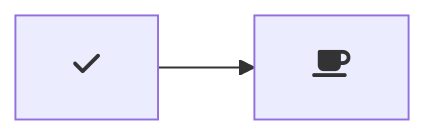

# 🛸 UFO-Detector - A simple UFO detection tool 🛸

Hello 👋, and welcome to the **UFO-DETECTOR** DataSet 👽

 This is a project dedicated to using image recognition technology in order to create an internet-accessible program for classifying known and unknown objects within the view of a telescope or camera.

[](https://github.com/ZanzyTHEbar/UFO-Detector/issues) [](https://github.com/ZanzyTHEbar/UFO-Detector/network) [](https://github.com/ZanzyTHEbar/UFO-Detector/stargazers) [](https://github.com/ZanzyTHEbar/UFO-Detector/blob/main/LICENSE)

Welcome to the **DIY UFO Detector**, automated *AI* and *Telescope* enabled 👽.

## WHAT IS THIS FOLDER ABOUT

This folder is dedicated to growing the dataset for training our classification models.

Here we will place all information regarding how to make your own dataset, as well as provide our current dataset(s) to you.

## COLLECTING THE DATASET

To generate the dataset we are going to use Google images(for now). This will be the first step in our process.

In order to collect the data yourself, you will need to use the Google images search engine or API.

To start off, we will put our keywords into the search engine and then use the below JavaScript code (can also be copied from urlscrapper.js) to get the URL's of the images.

Fire up the JavaScript console (I’ll assume you are using the Chrome web browser, but you can use Firefox as well by clicking View => Developer => JavaScript Console).

In Chrome, you can use the F12 key to open the JavaScript console, or you can right-click on screen and select Inspect, then navigate to the console.

After you scroll down to the section of the web-page you feel has the last of the relevant results, copy-paste the following code into the console:

```js
function simulateRightClick( element ) {
    var event1 = new MouseEvent( 'mousedown', {
        bubbles: true,
        cancelable: false,
        view: window,
        button: 2,
        buttons: 2,
        clientX: element.getBoundingClientRect().x,
        clientY: element.getBoundingClientRect().y
    } );
    element.dispatchEvent( event1 );
    var event2 = new MouseEvent( 'mouseup', {
        bubbles: true,
        cancelable: false,
        view: window,
        button: 2,
        buttons: 0,
        clientX: element.getBoundingClientRect().x,
        clientY: element.getBoundingClientRect().y
    } );
    element.dispatchEvent( event2 );
    var event3 = new MouseEvent( 'contextmenu', {
        bubbles: true,
        cancelable: false,
        view: window,
        button: 2,
        buttons: 0,
        clientX: element.getBoundingClientRect().x,
        clientY: element.getBoundingClientRect().y
    } );
    element.dispatchEvent( event3 );
}
```

Next, we will use the JavaScript console to get the URL's parameter of the images:

```js
function getURLParam( queryString, key ) {
    var vars = queryString.replace( /^\?/, '' ).split( '&' );
    for ( let i = 0; i < vars.length; i++ ) {
        let pair = vars[ i ].split( '=' );
        if ( pair[0] == key ) {
            return pair[1];
        }
    }
    return false;
}
```

Our next function assembles all the URLs in a convenient text file:

```js
function createDownload( contents ) {
    var hiddenElement = document.createElement( 'a' );
    hiddenElement.href = 'data:attachment/text,' + encodeURI( contents );
    hiddenElement.target = '_blank';
    hiddenElement.download = 'urls.txt';
    hiddenElement.click();
}
```

Each of our URLs will be in the contents parameter passed to our createDownload function. Here we first create a hiddenElement. We then populate it with the contents, create a destination link with a filename of urls.txt, and simulate a click of the element.

Ultimately when the createDownload function runs, your browser will trigger a download. Depending on your browser settings, your download may go to your default download location or you may be prompted to select a name and location for your image URLs file download.

Our last function brings the components together:

```js
function grabUrls() {
    var urls = [];
    return new Promise( function( resolve, reject ) {
        var count = document.querySelectorAll(
         '.isv-r a:first-of-type' ).length,
            index = 0;
        Array.prototype.forEach.call( document.querySelectorAll(
         '.isv-r a:first-of-type' ), function( element ) {
            // using the right click menu Google will generate the
            // full-size URL; won't work in Internet Explorer
            // (http://pyimg.co/byukr)
            simulateRightClick( element.querySelector( ':scope img' ) );
            // Wait for it to appear on the <a> element
            var interval = setInterval( function() {
                if ( element.href.trim() !== '' ) {
                    clearInterval( interval );
                    // extract the full-size version of the image
                    let googleUrl = element.href.replace( /.*(\?)/, '$1' ),
                        fullImageUrl = decodeURIComponent(
                         getURLParam( googleUrl, 'imgurl' ) );
                    if ( fullImageUrl !== 'false' ) {
                        urls.push( fullImageUrl );
                    }
                    // sometimes the URL returns a "false" string and
                    // we still want to count those so our Promise
                    // resolves
                    index++;
                    if ( index == ( count - 1 ) ) {
                        resolve( urls );
                    }
                }
            }, 10 );
        } );
    } );
}
```

The final snippet of code for the JavaScript console is the function that calls the grabUrls function and then creates a download of the URLs:

```js
grabUrls().then( function( urls ) {
    urls = urls.join( '\n' );
    createDownload( urls );
} );
```

After executing the above snippet you’ll have a file named urls.txt in your default Downloads directory.

Once this files is acquired, we can use the [download_images.py](UFO-Detector\download_images.py)
script to download the images to your local project directory.

//////////////////////////////////////////////////////////////////////////////////////////////////////////////////////////////

example of mermaid diagram with Font Awesome icons:


