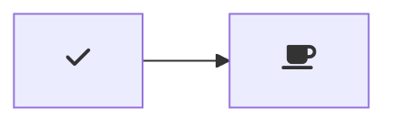

# 🛸 UFO-Detecor - A simple UFO detection tool 🛸

Hello 👋, and welcome to the **UFO-DETECTOR** DataSet 👽

 This is a project dedicated to using image recogition technology to create an internet-accessible program for classifying known and unknown objects within the view of a telescope.

   

Welcome to the **DIY UFO Detector**, automated *AI* and *Telescope* enabled 👽.

## WHAT IS THIS FOLDER ABOUT

This folder is dedicated to growing the dataset for training our classification models.

Here we will place all information regarding how to make your own dataset, as well as provide our current dataset(s) to you.

example of mermaid diagram with Font Awesome icons:

